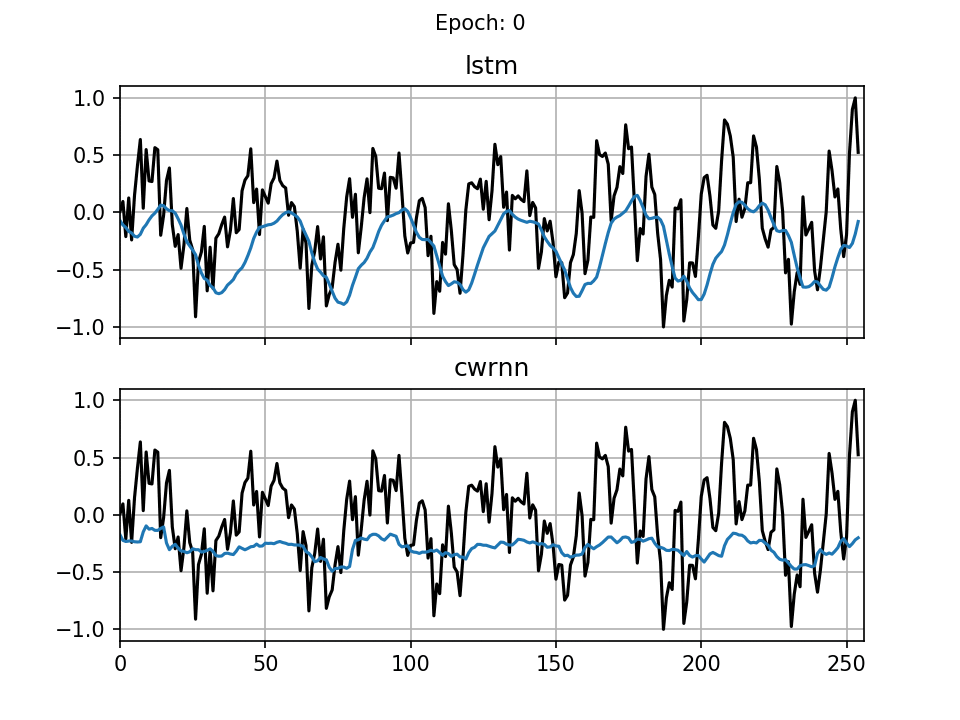

# ClockworkRNN
Clockwork RNN (CWRNN) Implementations for Tensorflow 2.3 and Keras 2.0.4 (Standalone).
The Clockwork RNN ([original paper](https://arxiv.org/abs/1402.3511)) provides modules with different periodic update frequencies. Its usage is demonstrated by generating a sinusoid sequence (see [paper](https://www2.informatik.uni-hamburg.de/wtm/ps/Alpay_ICANN_2016.pdf) for task description).

Example Code:
- sine_compare.py (CWRNN vs. LSTM)
- sine_compare_activation.py (CWRNN vs. LSTM with activation maps; see GIF below)
- sine_pca.py (CWRNN with activation map and PCA on state trajectories)

 

