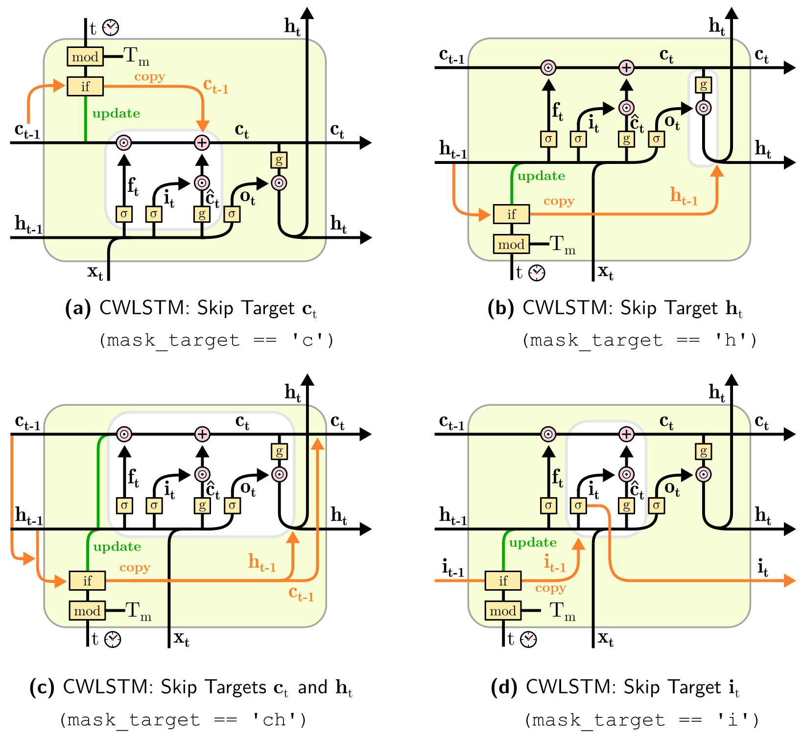

# ClockworkRNN
Clockwork RNN (CWRNN) and Clockwork LSTM implementations for Tensorflow 2.3 and Keras 2.0.4 (Standalone).

## CWRNN
The Clockwork RNN ([original paper](https://arxiv.org/abs/1402.3511)) provides modules with different periodic update frequencies. Its usage is demonstrated by generating a sinusoid sequence (see [paper](https://www2.informatik.uni-hamburg.de/wtm/ps/Alpay_ICANN_2016.pdf) for task description).

## CWLSTM
The CWLSTM is like the CWRNN - but with memory gates. There are 4 different variants which differ in the way the skipping mechanism is integrated with the gates. These can be accessed using the `mask_target` parameter:



If you're interested in reading more about the model, see *[Alpay, T. (2021). Periodicity, Surprisal, Attention: Skip Conditions for Recurrent Neural Networks](https://ediss.sub.uni-hamburg.de/bitstream/ediss/8944/1/Dissertation.pdf)*.

## Example Code:
- sine_compare.py (CWRNN vs. LSTM)
- sine_compare_activation.py (CWRNN vs. LSTM with activation maps; see GIF below)
- sine_pca.py (CWRNN with activation map and PCA on state trajectories)

 

## Citation
If you want to cite the CWLSTM, you can use:
```
@phdthesis{alpay2021periodicity,
  title={Periodicity, Surprisal, Attention: Skip Conditions for Recurrent Neural Networks},
  author={Alpay, Tayfun},
  year={2021},
  school={Department of Informatics, University of Hamburg, Germany}
}
```
